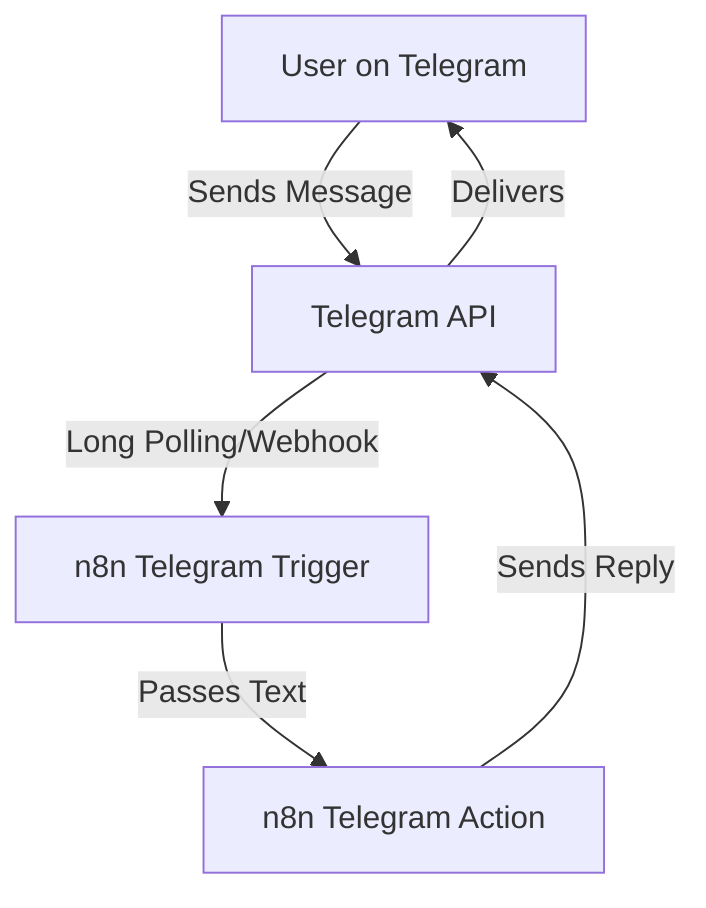

# Phase 2: Telegram Integration

Instead of WhatsApp Cloud API, we are using Telegram to allow immediate testing without waiting for Meta Business Manager approval.

## Setup Instructions for n8n

1. Open your n8n at [http://localhost:5678](http://localhost:5678).
2. Go to **Credentials** -> **Add Credential** -> Search for **Telegram API**.
3. Name it something like "My Telegram Bot".
4. Paste the bot token you got from BotFather (`8771682306:...`).
5. Save the credential.
6. Go to **Workflows** -> **Import from File**.
7. Select `n8n/workflows/02-telegram-webhook-receiver.json`.
8. In both the "Telegram Trigger" node and the "Telegram" action node, select the credential you just created.
9. Click "Test workflow" or activate it, and send a message to your bot on Telegram. It will reply back!

## How it works (Flow Diagram)

